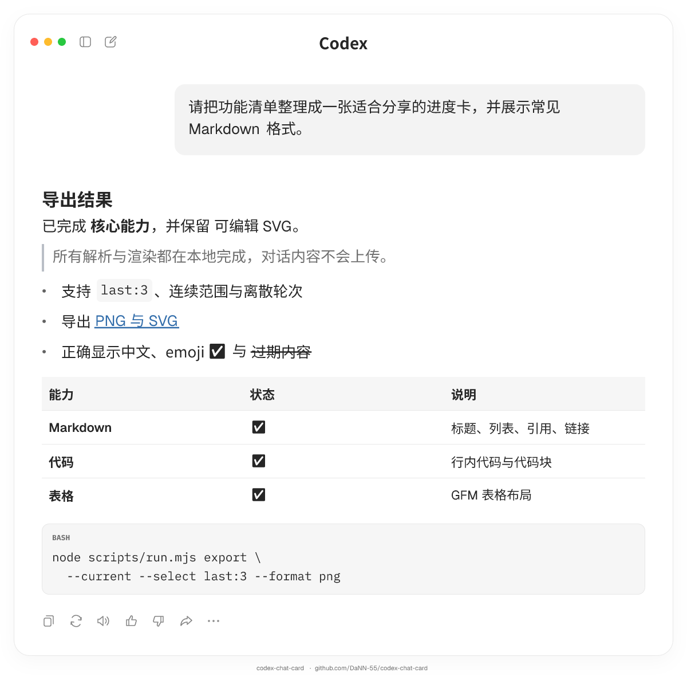
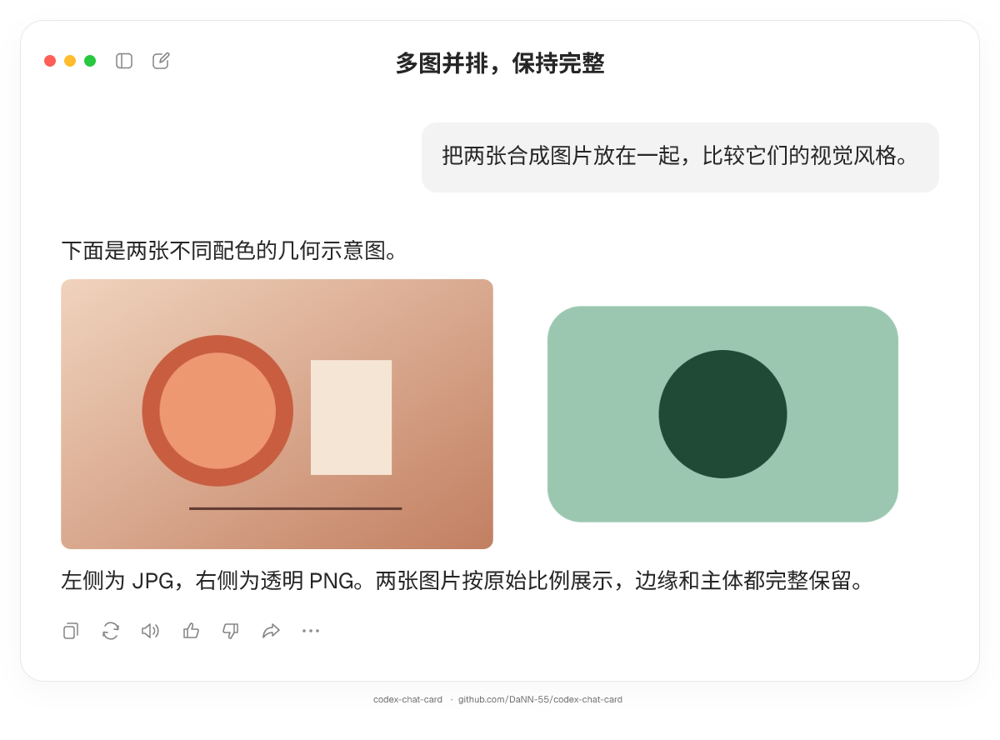
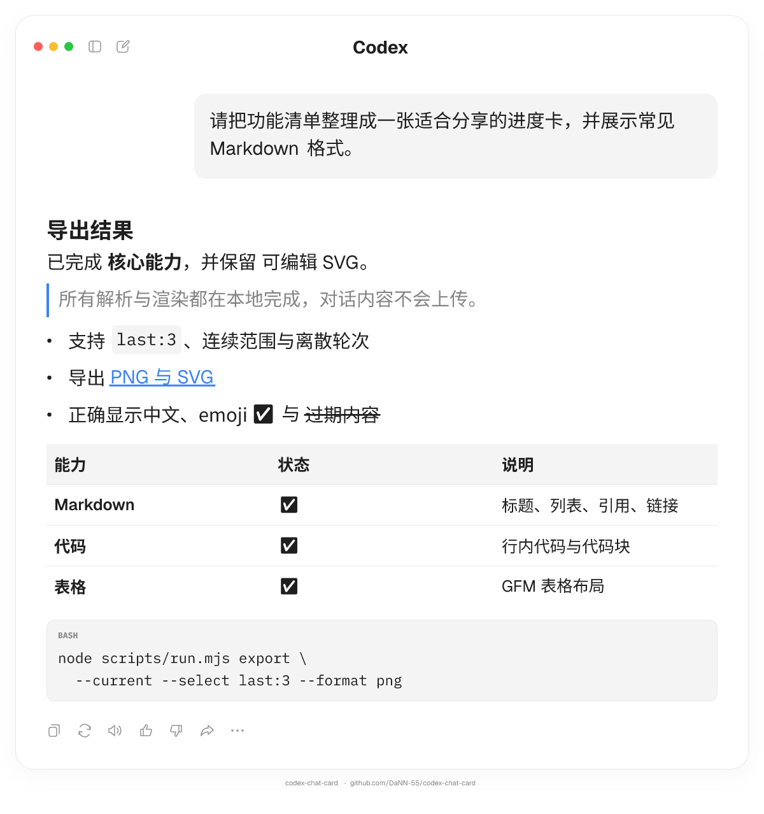
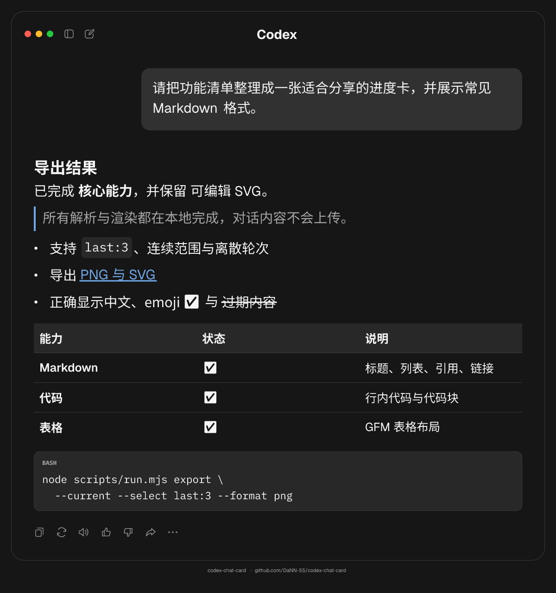
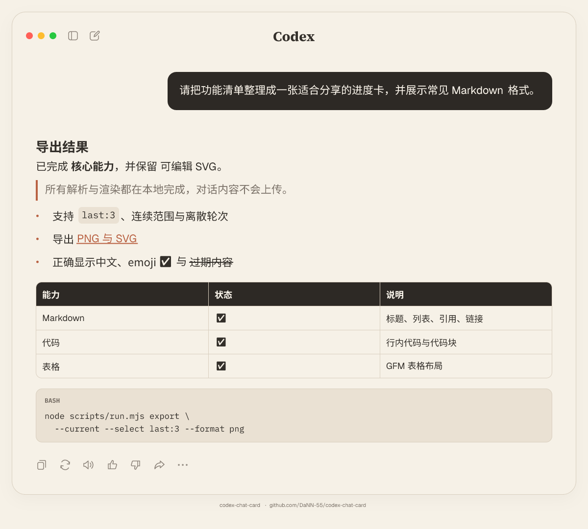
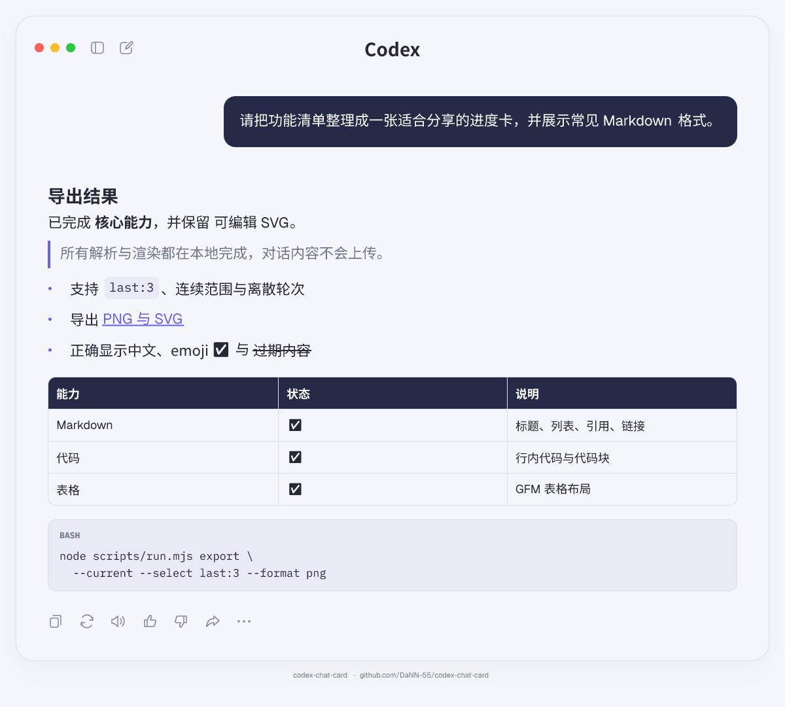
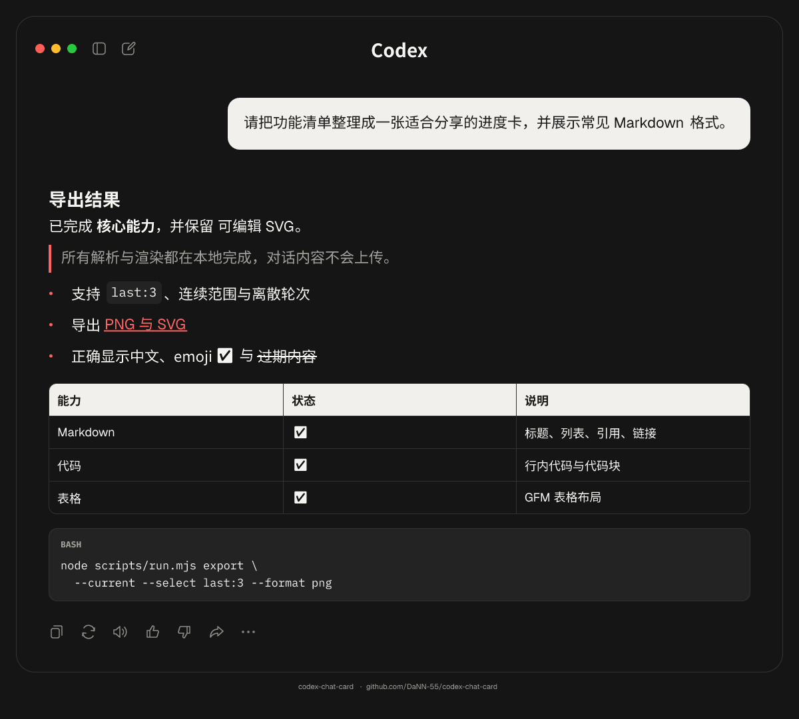
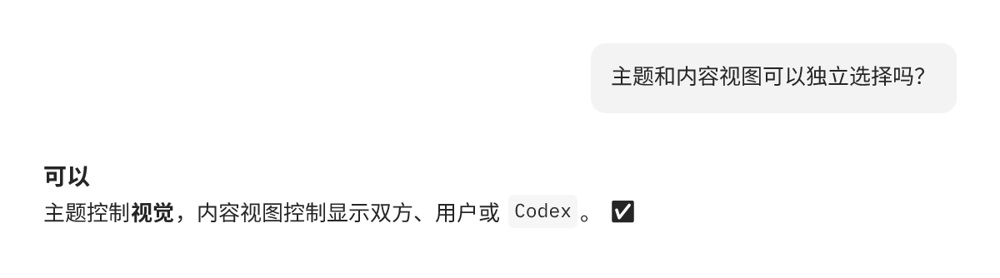
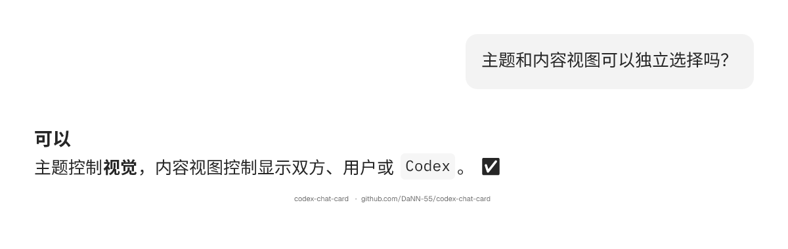
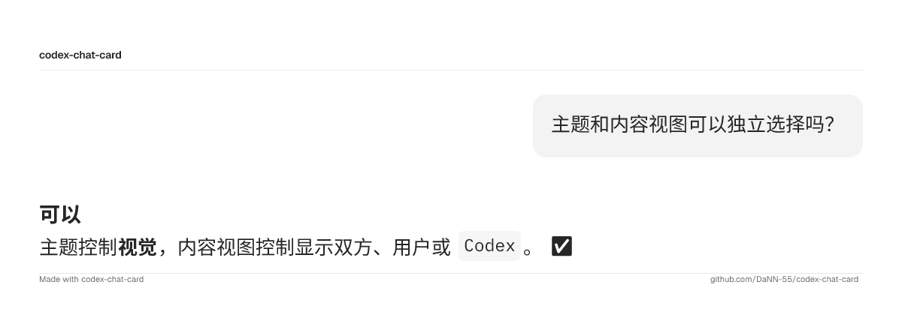

# Codex Chat Card

把 Codex Desktop 对话里选中的轮次导出成一张 PNG 长图，或可继续编辑的 SVG。

支持按轮次选择内容、只保留一方消息、切换主题，以及嵌入本地 PNG/JPG 图片。解析与渲染都在本地完成，不上传会话。

## 效果

下面这张合成对话展示标题、粗体、斜体、删除线、引用、列表、链接、表格、行内代码、代码块和 emoji 的实际导出效果。



### 图文混排

保留图片和文字的原始顺序；连续图片最多两列排列，等比缩小并完整展示，透明 PNG 保留透明背景。缺图会在原位置显示提示，后续文字继续保留。



支持本地 PNG、JPG/JPEG 和对应的 base64 data URL；相对路径以输入 JSONL 所在目录为基准。图片引用方式、大小限制与缺图规则见[运行说明](references/usage.md#会话图片)。

## 视觉风格

提供 **4 种固定主题 + 1 种跟随本机的自动主题**，主题、品牌展示和窗口外框可以独立组合。

| 主题 | 视觉特点 |
| --- | --- |
| `local-codex`（默认） | 跟随本机 Codex 的明暗外观、颜色和字体；读取失败时回退到 `codex-ink` |
| `codex-ink` | 白底、浅灰用户气泡、深色正文、蓝色链接 |
| `warm-editorial` | 暖纸色背景、深咖啡色气泡、陶土色点缀 |
| `frosted-indigo` | 冷蓝灰背景、靛蓝气泡、紫色点缀 |
| `raycast-night` | 近黑背景、浅色气泡、珊瑚红点缀 |

### 本机 Codex 主题

`local-codex` 会读取用户本地 Codex 配置中的明暗模式、颜色、字体和字号。下面使用合成配置分别展示 light 和 dark；实际导出效果以每位用户的本地配置为准。

<table>
  <tr>
    <th><code>local-codex · light</code><br><sub>合成浅色配置示例</sub></th>
    <th><code>local-codex · dark</code><br><sub>合成深色配置示例</sub></th>
  </tr>
  <tr>
    <td></td>
    <td></td>
  </tr>
</table>

### 固定主题

四种固定主题使用同一份 Markdown 内容生成，方便直接比较配色和排版差异。

<table>
  <tr>
    <th><code>codex-ink</code></th>
    <th><code>warm-editorial</code></th>
  </tr>
  <tr>
    <td></td>
    <td></td>
  </tr>
  <tr>
    <th><code>frosted-indigo</code></th>
    <th><code>raycast-night</code></th>
  </tr>
  <tr>
    <td></td>
    <td></td>
  </tr>
</table>

### 品牌展示与窗口外框

`--mode` 控制品牌信息：`minimal` 默认在底部显示一行小字署名，`clean` 隐藏品牌信息，`branded` 增加顶部名称和底部署名。下图均去掉窗口外框，方便比较。

<table>
  <tr>
    <th><code>clean</code></th>
    <th><code>minimal</code></th>
    <th><code>branded</code></th>
  </tr>
  <tr>
    <td></td>
    <td></td>
    <td></td>
  </tr>
</table>

`--mockup codex-window` 默认保留圆角窗口、居中标题、macOS 窗口按钮，以及侧栏、新建会话图标。每条可见的 Codex 回答下方带复制、重试、朗读、赞、踩、分享和更多图标。图标属于 PNG/SVG 中的静态外观。

`--mockup none` 隐藏窗口外框及上述图标。需要纯内容时可组合 `--mode clean --mockup none`。传入 `--title "会话标题"` 可替换窗口顶部默认的 `Codex` 标题。

## 特点

- **按轮次导出**：支持最近几轮、全部、连续范围和离散编号。
- **三种内容视图**：导出完整对话、只看用户消息，或只看 Codex 回答。
- **本机 Codex 外观**：默认读取本机明暗模式、颜色和字体；读取失败时回退到 `codex-ink`。
- **固定主题**：内置 `codex-ink`、`warm-editorial`、`frosted-indigo` 和 `raycast-night`。
- **两种格式**：PNG 适合直接分享，SVG 适合继续编辑。
- **Markdown 渲染**：支持标题、列表、链接、表格、代码块、中文和 emoji。
- **图文混排**：嵌入本地 PNG/JPG，保留图文顺序，连续图片以网格展示；缺图显示占位说明。
- **内容过滤**：图片只包含用户消息和 Codex 最终回答，不包含 reasoning、commentary 和工具日志。
- **轻量对话窗口**：居中标题、随内容收缩的用户气泡和自适应画布高度；`codex-ink` 与本机浅色外观采用浅灰气泡。

默认组合是 `local-codex` 主题、`minimal` 模式和 `codex-window` 外框。

## 安装

在 Codex 中使用 Skill Installer：

```text
使用 $skill-installer 从 https://github.com/DaNN-55/codex-chat-card 安装这个 Skill
```

也可以手动安装。需要 Node.js 20+ 和 npm：

```bash
git clone https://github.com/DaNN-55/codex-chat-card.git \
  ~/.agents/skills/codex-chat-card
```

安装后如果没有立即显示，重启一次 Codex。首次使用时，Skill 会在安装目录执行 `npm ci --omit=dev --ignore-scripts` 下载锁定的运行依赖，然后继续原来的预览或导出命令；这一步需要网络和一次安装目录写入权限。后续使用不会重复安装，除非 `package-lock.json` 发生变化。

## 用法

直接告诉 Codex 要导出哪些内容：

```text
使用 $codex-chat-card 导出最近三轮对话。
```

也可以一次说清轮次和样式：

```text
使用 $codex-chat-card 导出第 2–4 轮完整对话，
使用 warm-editorial 主题、branded 模式和 Codex 窗口外框。
```

没有指定轮次时，Skill 会先列出带编号的对话预览，再询问要导出哪些轮次。

## 命令行

列出当前会话最近 10 轮：

```bash
node scripts/run.mjs list --current --limit 10
```

导出最近 3 轮：

```bash
node scripts/run.mjs export \
  --current \
  --select last:3 \
  --content conversation \
  --mode minimal \
  --mockup codex-window \
  --output output/chat.png
```

无法自动定位当前会话时，用 `--input /path/to/session.jsonl` 代替 `--current`。全部参数和示例见 [`references/usage.md`](references/usage.md)。

## 隐私

Skill 只在本地读取 Codex JSONL、所选内容引用的图片、字体和外观设置，然后把导出文件写入指定路径。远程图片 URL 不会自动下载。项目不包含上传或遥测功能。

分享前请检查导出图片是否包含不适合公开的信息。仓库截图和测试只使用合成或已脱敏内容。

## 本地测试

```bash
npm ci
npm test
```

测试覆盖会话解析、无效轮次选择、内容视图、主题回退、Markdown、emoji、图文顺序、图片嵌入和缺图占位，以及 PNG/SVG 内容完整性。半截日志和重复事件的现有边界见下方限制说明。

重新生成 README 中的全部示例（仅使用合成会话、图片和配置）：

```bash
npm run assets:readme
```

## 目录结构

```text
SKILL.md             Skill 工作流和默认行为
scripts/run.mjs      首次运行依赖初始化和统一命令入口
scripts/src/         TypeScript 源码
scripts/dist/        可直接运行的编译产物
scripts/test/        自动化测试
references/usage.md  参数、选择规则和命令示例
assets/readme/       README 展示图片
```

## 当前限制

- 当前会话自动定位面向 Codex Desktop 会话日志。
- Codex 日志格式和本地外观配置可能变化，运行时会使用兼容回退。
- 含不完整 JSON 行或非法 JSON 的日志会整体报错；当前格式的重复 `item_completed` 事件尚未去重。
- 一张图片只能使用一种内容视图；混合角色需求会分别导出。
- 图片限本地 PNG/JPG/JPEG 和对应的 data URL；远程图片、PDF、Office 文档、音频和视频尚不支持直接渲染。
- 超长对话应拆成多个较小的导出任务，暂不自动分页。

## 许可证

本项目使用 [MIT License](LICENSE)。第三方依赖及其许可证见[第三方软件说明](THIRD_PARTY_NOTICES.md)。
